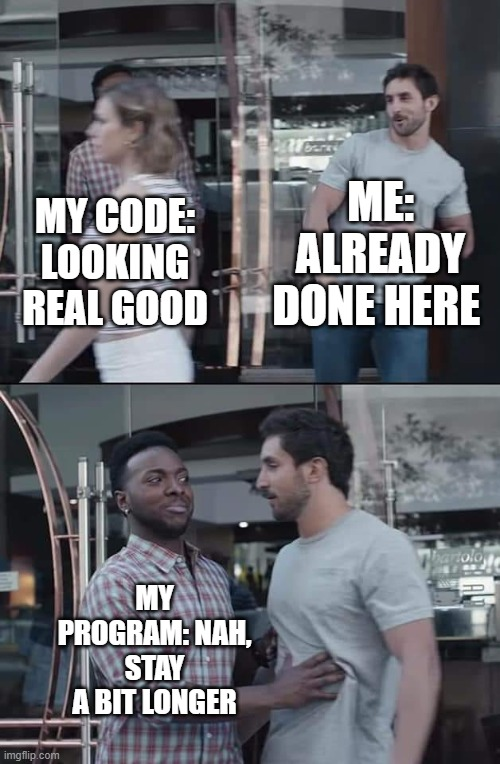

<div style="float: left; margin-right: 10px;">
  
</div>

My first week with ESLint changed my impression of coding style guides. My experience using a style guide in the past, with Java in ICS 111, was not the best. Installing it along with the Eclipse IDE was the first assignment we were given as our introduction to programming. I didn’t have the opportunity to first just program, so I don’t think I was able to appreciate its use. The squiggly red lines under the already-correctly functioning code were just annoying pests I had to get rid of. In the two next computer science courses I took, I was free to program without the style guide.

## I Don't Need No Help

It’s been a different approach to Javascript. For the first few weeks, all I had to really worry about was that the code functioned as intended. I enjoyed the freedom of programming without strict conformance to a style guide. I still tried to conform to best practices, such as opting for ```let``` and ```const``` rather than ```var```, and maintain consistency in my personal code structure. I would stop every once and a while to review my own code, making sure I have my matching brackets or parentheses, and not trying to reassign a ```const```, for instance. So I felt like I didn’t really need the style guide critiquing my code.

## Ok, Maybe A Little Help Is Nice

Very soon after getting ESLint configured, though, I found it helpful, rather than an annoyance. I went to define a function ```doAThing(data) { }``` and there were a couple of errors with it. I figured it was because I hadn’t finished the definition and hadn't called it yet, so I continued on and did those things. The error persisted though, so I hovered over it to find that it was due to an ```Unexpected token: {```. After the initial “huh??” came an “Oh, duh, I forgot the ```function``` keyword”. There was also an error with my ```let myArray = [];```. I defined it with ```let``` since I knew I’d be pushing elements to the array, but I should have used ```const``` because I wasn’t changing what myArray refers to, just modifying what’s inside, something that is perhaps not as intuitive.

## It's Not That Bad

The error with my function likely wouldn’t have taken much longer to troubleshoot, either upon a quick code review or after getting an error when running the program. But it still saved me time and from wanting to bang my head on the desk, something that would have been more likely if I were working with a longer program. The second ESLint error, with my array, wouldn’t have even hindered my program and I’d have been none the wiser. But, if it were again a larger program, there’s that much more room for a mistake to be made and possibly go unnoticed. 

## My Code Is Stylish So Now I Can Spend More Time Wondering Why It's Not Working

After completing a couple class assignments with ESLint, I worked on a small personal program without it enabled. I noticed I was missing its use. I still don’t want to see those squiggly red lines, but I’ve learned they’re not the enemy, they’re your friend. It works as a bookkeeper, a to-do list, and a spotlight. It thinks about the trivial and mundane so you don’t have to. Instead, you can spend more time focusing on the important things, like finding that pesky 10,001st prime number. And if everyone conformed to a uniform coding style, reviewing someone else’s code would be a less painful process since you could expect their code to follow the same structure.

