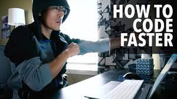

*Difficulty: a thing that is hard to accomplish, deal with, or understand.*

I wanted to title this essay, “First Foray into Javascript”, but then I’d be lying. Back when Codecademy was 100% free, I started learning how to program by going through their Javascript course. I think the furthest I got was learning about conditionals, so I didn’t learn much, nor did I remember much when I started my degree here a couple of years ago. You could probably say that this is my second first foray into the language. 

Now that I’m a couple years into the CS degree program here at UH Manoa and have programmed in Java, C, and C++, Javascript seems pretty familiar already on the surface. There are small differences in syntax and features, such as declaring variables with *let* and *const* instead of *var*, but those were easy to overcome. What struck me was just how simple everything is so far compared to the other languages I’ve programmed with. I don’t need to specify the data type of variables or values and I can very seamlessly create arrays the same way as I would a number or string by just using brackets. This free-natured approach, along with the vibrant community, makes it a good language to learn for beginner software engineers, but I am glad that I was made to start off with Java, C, and C++. While I’m sure moving into those languages from Javascript would have been easier than nothing, it still would’ve been a shock with how much more strict they are.

The ease of transition to Javascript has been significant in being able to jump into our practice WODs. And vice versa, this athletic software engineering has been allowing me to grasp Javascript faster and -- more importantly I think -- more confidently than the others. The idea of them worried me at first because I thought about how long it has taken me in the past to do programming assignments. I would obsess over how to code it in the best way possible and then not have much to show for it. I frequently had to look up syntax because I never really had to commit it to memory since I had all the time in the world (well, until the assignment deadline!). With the WODs, I don’t have time to obsess, I just gotta go and put words onto the screen. Having very limited time, I’m learning to become more efficient, not just in typing up the code, but also doing quick searches on what I don’t know or can’t quite remember exactly.

I haven’t succeeded on the first try of a WOD yet, but on each one of them, I’ve been very close. Even just 10 or 15 more seconds would have been enough. Instead of them being stressful, I’ve found it quite fun to race the clock. After a couple tries of each the first and second WOD, I’ve managed to get my time down to under three minutes. I still made mistakes in those, but they’re usually mistypes or missed semicolons, etc., that I’ve become increasingly faster at catching. It’s maybe too soon to tell, but I think “athletic software engineering” is a good match for me, and the WODs are short enough to be easy to revisit and run through, like using the SRS method to review new vocabulary in a foreign language. 
