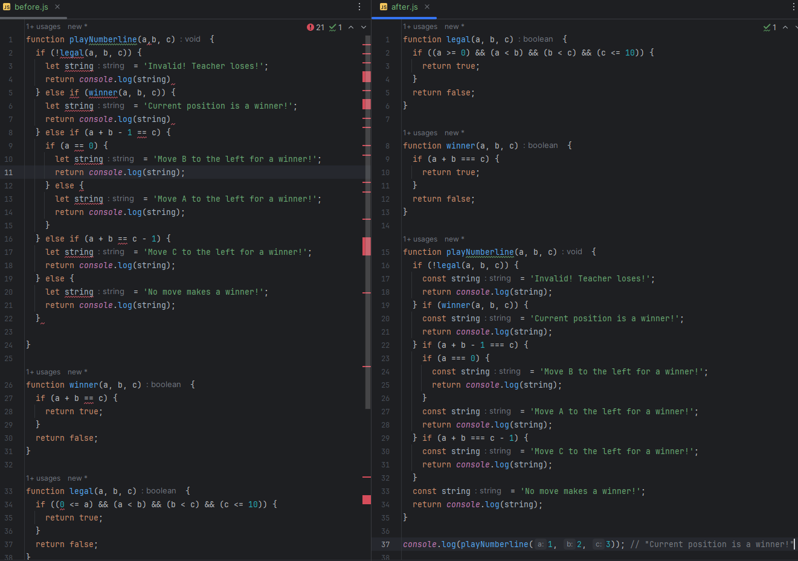

Now that ICS 314, my introductory class to software engineering, is coming to a close, there’s much to reflect on what I’ve learned. In some ways, it’s what I expected of it: learn a little about a lot. Before this class, I really had no idea how to go about developing a full-fledged application. I didn’t even know how to use GitHub. I knew of the concepts, but I didn’t really grasp just how important they were, particularly development environments and coding standards.

## The Importance of Proper Environments for Developing Engineers

In my introductory class to computer science and programming, we had to use the Eclipse IDE. The small programs we were writing then did not at all lead me to appreciate what all an integrated development environment has to offer. After going through ICS 314, I get it: they’re essential to developing an actual application. We used IntelliJ IDEA in this class, and the features were so much more appreciated. With how many interconnected files we were working with in our assignments, having IntelliJ be able to see the entirety of the project folder was a godsend. Without an IDE, something as simple sounding as renaming a file or function could be an extremely tedious endeavor if it is being imported by other files, but IntelliJ’s ability to search for all instances of its use and rename them made it trivial. 

  

## Coding With Higher Standards

Extra functionality via plugins is another feature that has made a big difference. Installing ESLint, for example, has helped facilitate cleaner coding standards that makes it easier to collaborate on projects, whether open source or as part of a team. It’s another concept that I did not appreciate in prior classes, but do now. I viewed it as something that wasn’t really necessary, and somewhat annoying to have to conform to. These group projects, including assignments that have us expanding on the professors’ code, have made it clear as to why coding standards are necessary in software engineering. Small code with weird or inconsistent formatting and spacing is whatever, but with how sprawling an application can be, it could be a nightmare to read. 

## Night and Day 

There’s many concepts I’ve learned in this introductory course that I’ve only scratched the surface of, such as UI frameworks and agile project management, and could have written about. But neither of those and others had I really been exposed to previously. I felt development environments and coding standards were two topics that I’ve been able to really reflect on since I can compare them like night and day to before software engineering and now. I didn’t understand why they were being shoved on us in ICS 111 with how small our programs were, but I see now that it was to develop good practices for when they actually do become important, such as in team-based projects. Unlike development environments and coding standards though, I understood coming into ICS 314 why concepts like frameworks and project management were important, but there is still much more to learn about them. I look forward to future SWE classes and experiences so that I can have similar night and day reflections on the topics introduced to me in this class.
