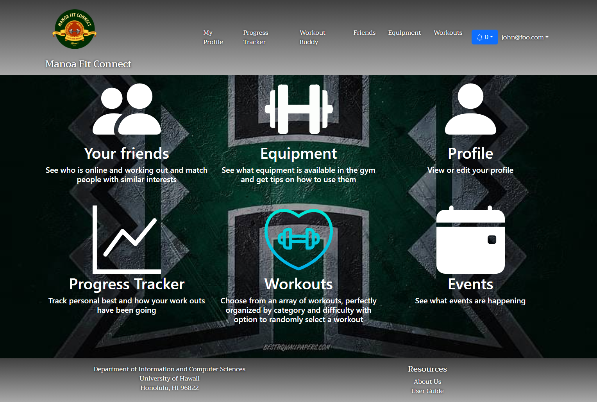
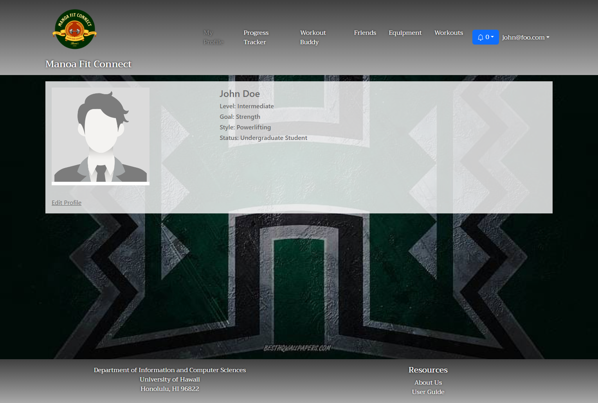

Manoa Fit Connect is an application our team developed for gymgoers and those who are hesitant to become gymgoers. Our primary aim was to connect them with workout partners that they would match well with by identifying similar workout goals and styles. Other features of the application are a progress tracker that records workouts and personal bests, a page to familiarize gymgoers with equipment present at the UH Manoa gym, and a page to connect users with events happening in the community.

  

My responsibilities for the project were to develop the user profile and profile customization pages, as well as the signup page. The signup page was rather straightforward in registering new users to the site. The profile customization page was designed to facilitate searching for workout partners. It includes customization options for identifying information such as name and image as well as matchmaking information such as experience level and workout preferences. The user profile page displays that information for others to see.

  

I learned a lot from developing this application. Many of my initial ideas for the pages I was responsible for went unimplemented. I think I was too unrealistic with my ambitions right off the bat and that led me to want to develop my pages to that of a finished product. I spent too much time obsessing over how to perfect it, when I should have been developing it incrementally. I think it would have been better if I had started development with a minimum viable product in mind instead, and then expanded from there. 

Our [organization page](https://manoa-fit-connect.github.io/) includes links to the [source code on GitHub](https://github.com/manoa-fit-connect) and to the [application homepage](https://manoafitconnect.com/).
